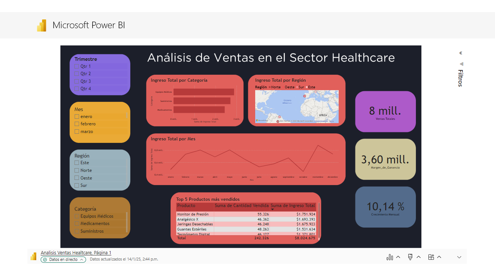

# Dashboard de Ventas Healthcare

Este proyecto presenta un análisis detallado de las **ventas en el sector de Healthcare**. El dashboard permite explorar varias métricas clave, como ventas por categoría de producto, tendencias de ventas mensuales, y desempeño por región.

## Descripción

El dashboard de ventas está diseñado para proporcionar una visión completa sobre el rendimiento de las ventas de productos en el sector salud. Incluye análisis sobre:

- **Ventas por categoría de producto**
- **Tendencias mensuales de ventas**
- **Ventas por región geográfica**
- **Top 5 productos más vendidos**
- **KPIs clave** como crecimiento mensual y ticket promedio

Este análisis es útil para tomar decisiones informadas sobre el rendimiento de los productos y optimizar estrategias de ventas.

## Visualización del Dashboard

A continuación, una captura de pantalla del dashboard:

## Archivos del Proyecto

- **Dashboard_Ventas_Healthcare.pbix**: El archivo principal de Power BI que contiene el dashboard interactivo.
- **Captura del Dashboard**: Imagen del dashboard en formato PNG, que puedes ver arriba.

## Tecnologías Utilizadas

- **Power BI**: Para la creación del dashboard interactivo.
- **DAX**: Para la creación de medidas y KPIs.
- **Datos simulados**: Se utilizaron datos ficticios de ventas en el sector healthcare para la creación de este dashboard.

## Cómo Ejecutar el Proyecto

1. **Requisitos**: Asegúrate de tener Power BI Desktop instalado para abrir el archivo `.pbix`.
2. **Descargar el archivo**: Haz clic en el archivo [Analisis Ventas Healtcare.pbix](https://github.com/e-capetillo/Portafolio/blob/c0a84b85175ea48702c92880fff8e51defbc7d55/Analisis%20Ventas%20Healtcare.pbix) para descargarlo.
3. **Abrir en Power BI Desktop**: Una vez descargado, abre el archivo en Power BI Desktop para explorar el dashboard y las visualizaciones.

**Proyecto creado por:** Emily Capetillo López  
**Fecha de Creación:** Enero 2025  

---

# Business Case: Optimización del Consumo de Gasolina  

Este proyecto presenta un análisis detallado para reducir el consumo de gasolina en la flota de **Transportes CALO**, logrando una mejora en la eficiencia operativa y un ahorro anual proyectado de $76,275 USD.  

## Descripción  

El análisis se centra en optimizar el rendimiento de los vehículos mediante:  
- **Monitoreo en tiempo real** del consumo de gasolina.  
- **Identificación de patrones** en datos de rutas y conductores.  
- **Dashboards interactivos** para visualizar métricas clave como consumo por unidad, horas en inactividad y estado del mantenimiento.  

## Archivos del Proyecto  

- **Business Case.pbix**: Archivo de Power BI con el dashboard interactivo.
- **Business Case.pdf**: Archivo en PDF con el análisis completo del caso de negocio.
- **Captura del Dashboard**: Imagen del dashboard en formato PNG.

## Tecnologías Utilizadas  

- **Power BI**: Para la creación del dashboard interactivo.  
- **Python**: Para el análisis de datos y generación de métricas.  
- **Datos simulados**: Basados en escenarios reales del sector transporte.  

## Cómo Ejecutar el Proyecto  

1. **Requisitos**: Tener Power BI Desktop instalado.  
2. **Descargar el archivo**: Descarga el archivo `.pbix` desde este [enlace](https://github.com/e-capetillo/Portafolio/blob/POWERBI/Business%20Case.pbix).  
3. **Abrir en Power BI Desktop**: Explora las visualizaciones y métricas del proyecto.  

**Proyecto creado por:** Emily Capetillo López  
**Fecha de Creación:** Julio 2024  

---

# Análisis del Desempeño de Ventas en Cadena de Supermercados  

Este proyecto utiliza **Power BI** para realizar un análisis visual exhaustivo del desempeño de ventas en una empresa de supermercados. Las visualizaciones incluyen mapas, gráficos de barras, anillos y embudos, proporcionando insights clave para la toma de decisiones estratégicas.  

## Descripción  

El dashboard presenta los siguientes análisis principales:  
- **Importe de venta por zona y país**: Visualizado mediante treemaps y mapas coropléticos para identificar zonas rentables.  
- **Comparativa de ventas por año**: Gráficos circulares y de columnas apiladas para observar tendencias temporales.  
- **Costes totales vs ingresos**: Análisis por zona geográfica para evaluar rentabilidad.  
- **Unidades vendidas por zona**: Gráficos de anillos que destacan patrones de consumo.  
- **Embudo de ventas por tipo de producto**: Comparativa de ventas en unidades, importe de venta e importe coste.  

## Insights Clave  

- Identificación de zonas o países más rentables para oportunidades de expansión.  
- Detección de productos más rentables para optimizar inventario y estrategias de promoción.  
- Evaluación de la rentabilidad por mercado y ajustes en estrategias de precios.  
- Identificación de cuellos de botella en el proceso de ventas mediante el análisis del embudo.

## Archivos del Proyecto  

- **Análisis en Cadena de Supermercado.pbix**: Archivo principal de Power BI con todas las visualizaciones.  
- **Captura del Dashboard**: Imagen del dashboard en formato PNG.

## Tecnologías Utilizadas  

- **Power BI**: Para la creación y visualización del análisis.  
- **DAX**: Para cálculos y medidas personalizadas.  
- **Datos simulados**: Generados para representar escenarios reales en el sector minorista.  

## Cómo Ejecutar el Proyecto  

1. **Requisitos**: Tener Power BI Desktop instalado.  
2. **Descargar el archivo**: Descarga el archivo `.pbix` desde este [enlace](https://github.com/e-capetillo/Portafolio/blob/POWERBI/An%C3%A1lisis%20en%20Cadena%20de%20Supermercado.pbix).  
3. **Abrir en Power BI Desktop**: Explora las visualizaciones y análisis.

**Proyecto creado por:** Emily Capetillo López  
**Fecha de Creación:** Enero 2024 

---

## Contacto  

Para dudas o sugerencias, puedes contactarme a través de GitHub o por correo electrónico [emi.capetillo@gmail.com](mailto:emi.capetillo@gmail.com)

